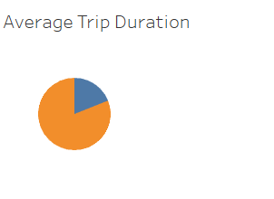

# Bikesharing

## Overview

This Storyboard of visualizations created in tableau was designed for the attention of the potential investors of the Des Moines startup bike-sharing program. The following collection of worksheets displays relevant data of a current bike-sharing program in New York City. The link to the Tableau.public file can be found [here](https://public.tableau.com/app/profile/johnwlandeen/viz/CitiBikeChallenge_16634667741990/CitiBikeStory?publish=yes). 

## Results

This linegraph represents how many users utilized bikes and how long they utilized them for.

This linegraph displays use over time similar to the previous chart but breaks up the users into three groups being Male, Female, and Unkown from top to bottom.

This heatmap displays popular times of use for the NYC bike-sharing program for the entire customer base.

This heatmap gives us an idea on popular times for bike use relevent to each gender category.

This heatmap shows us the popular days of the week for each of the three recorded gender categories between two types of bike-sharing user being either customer of subscriber.

This geographical heatmap displays the popularity of places in New York city where users begin bike rides with larger darker circles representing more use and smaller lighter circles representing less.

This pie chart shows the total use of each type of user being either subscriber or customer in the overall whole of bike-share use.

## Summary

To summarize, the results would seem to conclude that Men are the largest demographic present followed by Females with subscriptions having the highest use of the bike-share system. The Des Moines bike-share would best start by targetting Men with the highest budget in advertising and push subscription to encourage more use of the system. With a strong demographic having more continual use of the product, the company should see an increase in popularity and subscriptions over time.

